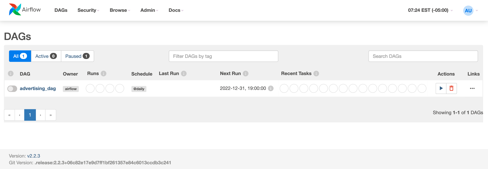

# Data Engineering Portfolio Project

This project is designed to demonstrate data engineering skills using Python, Docker, and Apache Airflow. It involves collecting, processing, and analyzing advertising data.

## Overview

The project simulates a real-world data pipeline where advertising data is extracted, processed, and then analyzed. It uses **Airflow** for workflow orchestration and **Pandas** for data manipulation. The entire environment is containerized using **Docker**.

## Project Structure

```
.
├── Dockerfile
├── docker-compose.yml
├── pyproject.toml
├── airflow
│   ├── dags
│   │   └── advertising_dag.py
│   ├── scripts
│   │   └── init.sh
├── data
│   └── advertising.csv
└── requirements.txt
```

### Key Components

- **Dockerfile**: Defines the environment for the project, including dependencies.
- **docker-compose.yml**: Configures the Docker containers for Airflow and PostgreSQL.
- **Airflow DAGs**: The `advertising_dag.py` defines the workflow for the data pipeline.
- **Scripts**: Contains initialization scripts for setting up the Airflow environment.
- **Data**: Contains sample advertising data for processing.

## Getting Started

### Prerequisites

- Docker
- Docker Compose

### Setup

1. **Clone the Repository**:
   ```sh
   git clone https://github.com/jrmistry/data-eng-demo.git
   cd data-eng-demo
   ```

2. **Build and Start the Docker Containers**:
   ```sh
   docker-compose build
   docker-compose up
   ```

3. **Access Airflow**:
   - Open your browser and go to `http://localhost:8080`.
   - Log in with the default credentials:
     - Username: `admin`
     - Password: `admin`

### Running the DAG

1. **Activate the DAG**:
   - Go to the Airflow web interface.
   - Find `advertising_dag` in the list and Unpause it.




2. **Trigger the DAG**:
   - Manually trigger the DAG to start processing the data.

## Project Details

### Data Pipeline

The data pipeline involves two main tasks:

1. **Extract Data**: Simulates extracting advertising data and saves it as a CSV file.
2. **Process Data**: Reads the extracted data, calculates the Click-Through Rate (CTR), and saves the processed data.

### Directory Creation

The project ensures that the necessary directories exist before writing any data to them. This avoids file not found errors during the workflow execution.

## Setting Up Pre-commit Hooks
To ensure consistent code formatting and quality, this repository uses pre-commit hooks. Follow these steps to set up the pre-commit hook on your local machine:

### Prerequisites
- Python and pip installed on your machine.
- Docker and Docker Compose installed (for running the main project).

### Steps
1. Install Dependencies: Install the required Python packages, including pre-commit:

```sh
pip install -r requirements-dev.txt
```

2. Install Pre-commit Hooks: Set up the pre-commit hooks defined in the .pre-commit-config.yaml file:

```sh
pre-commit install
```

By following these steps, the pre-commit hooks will automatically check and format your code before each commit, ensuring consistency and quality in the codebase.

## Troubleshooting

### Common Issues

- **Permission Errors**: Ensure all necessary directories and files have the correct permissions.
- **Database Connection**: Verify that PostgreSQL is running and accessible from Airflow.

### Logs and Monitoring

Use the Airflow web interface to check logs and task instance details for debugging and monitoring the pipeline's progress.

### Can not log-in to airflow
If the `admin` account does not exist and you are not able to log into airflow, following the steps below.

1. Start the Airflow containers: Ensure the Airflow services are running. If they aren't, you can start them using:

```sh
docker-compose up
```

2. Access the Airflow container: Open a terminal and run the following command to access the Airflow container:

```sh
docker exec -it <container_name> /bin/bash
```

Replace <container_name> with the name of your running Airflow container. You can find the container name by running docker ps. It may be something like `data-eng-demo-airflow-1`.

3. Create an Airflow user: Once inside the container, create an Airflow user with the following command:

```sh
airflow users create \
  --username admin \
  --firstname Admin \
  --lastname User \
  --role Admin \
  --email admin@example.com \
  --password admin
```

This command manually creates an admin user with the username admin and password admin.

4. Login to Airflow: Now, you should be able to access the Airflow web interface at http://localhost:8080 using the credentials:

```
Username: admin
Password: admin
```

## Contributions

Feel free to fork this repository and make contributions. Any feedback or suggestions are welcome!

## License

This project is licensed under the MIT License.
